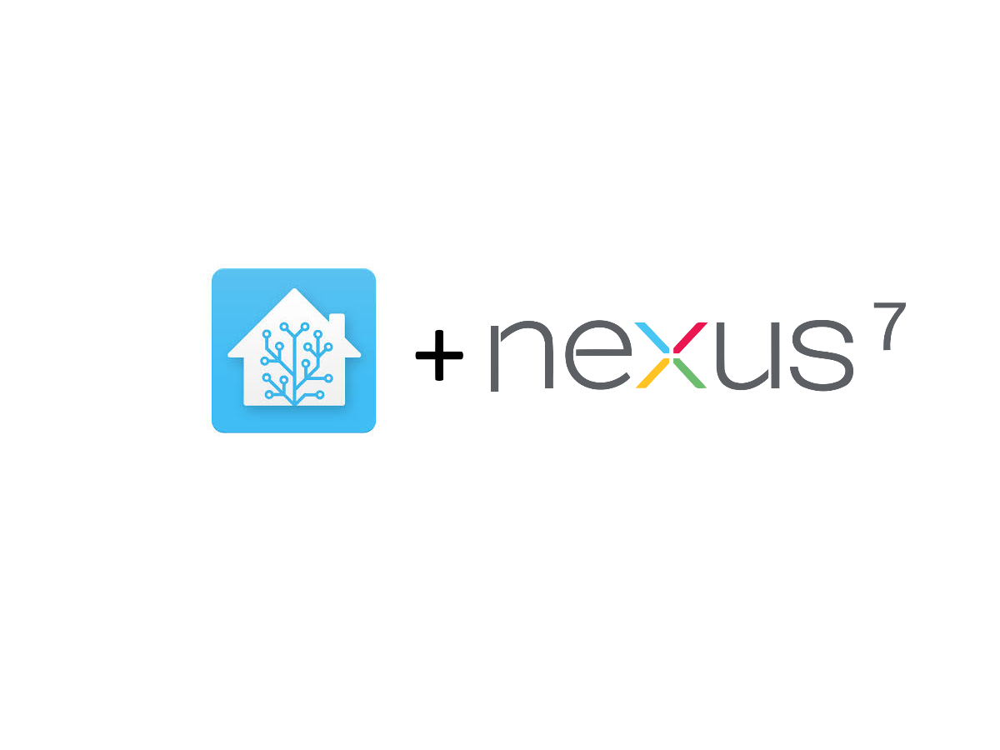
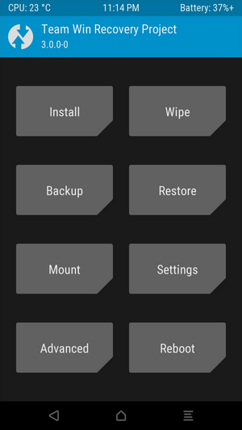
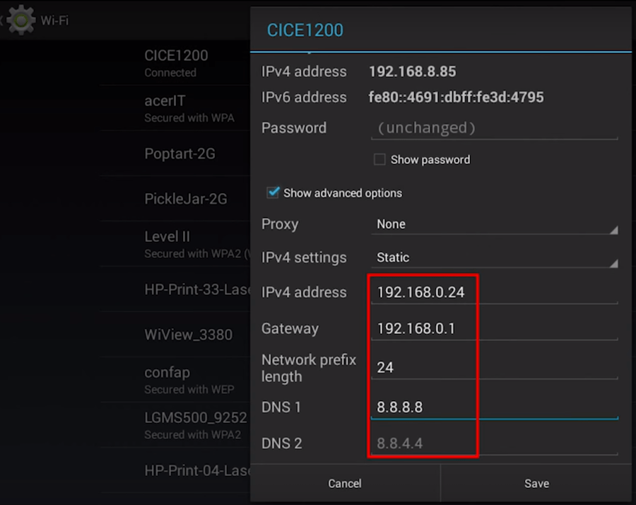
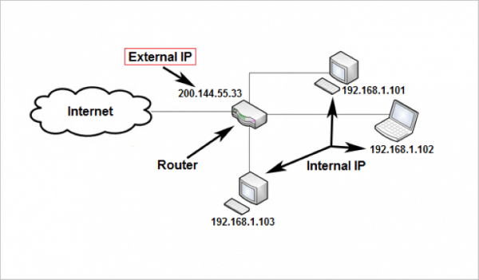
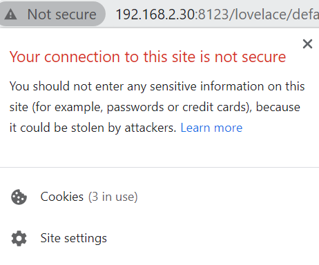

[Home Assistant](https://www.home-assistant.io/) installation on a Google Nexus 7 tablet. A similar setup process can be followed for any Android device.

# Background
I like to print out a hard copy of the New York Times crossword puzzle. Navigating to the puzzle and printing it out was making me feel like a human `for` loop, so I tried to create an automation with Google Assistant and [IFTTT](https://ifttt.com/). Unfortunately, the process is too complex for those tools: the URL of the crossword changes each day, the puzzle needs to be downloaded from that URL, then the puzzle needs to be sent to the printer.

Further research pointed me toward [Home Assistant](https://www.home-assistant.io), which has all the tools needed for this task. In addition, Home Assistant is extensible: it requires much more setup than IFTTT, but once set up, it is ready for all sorts of automations beyond a crossword printout.

The Home Assistant installation guide recommends using a Raspberry Pi to run the automation server. I had a Google Nexus 7 (2013) tablet lying around, so I set out to make use of it instead. An additional benefit is that the tablet can be used as a wall-mounted UI for Home Assistant - this is something you can do regardless of where the Home Assistant server is hosted, but this setup allows the server and UI to be run on one device.

## Prerequisites
- Hardware: tablet or phone running Android
	- This guide uses the Google Nexus 7 (2013) tablet as an example.
- Software: Android 5.0.0
- Tools: a computer, and a micro USB cable to connect the tablet to the computer

# LineageOS Installation
The Nexus 7 tablet stopped receiving software updates as of Android 5 (Lollipop). Such an old version of Android causes lots of incompatibilities. In addition, an old tablet is likely to be bogged down with old files and apps - an operating system refresh removes those and speeds the tablet up.

You may be able to install a more recent version of Android, if you're able to find a ROM for it online, but an easier approach is to install [LineageOS](https://www.lineageos.org/), which is a free and open-source Android distribution. The latest version at the time of writing is LineageOS 17.1 (which equates to Android 10). Let's dive into the steps required to install LineageOS on the tablet.

## Backup Files
If you have anything you care about on your Nexus 7 (files, configuration, etc), back it up to another location now. The tablet will be factory reset during the operating system re-install.

## Download Files
These files will be required for the LineageOS installation:
- [Team Win Recovery Project (TWRP)](https://dl.twrp.me/flo/twrp-3.4.0-0-flo.img)
    - The link is to version 3.4.0, but you can select whatever the latest version is.
- [LineageOS 17.1](https://lineageos.wickenberg.nu/flo)
    - Navigate to Google > flo, then select the most recent build for version 17.1.
- [addonsu 17.1](https://github.com/alexanderhale/home-assistant/tree/main/docs/tablet_setup/lineage_os/addonsu-17.1-arm.zip)
    - Saved in this repository in case [the source](https://androidfilehost.com/?fid=8889791610682882454) is no longer available.
- [sysrepart.zip](https://github.com/alexanderhale/home-assistant/tree/main/docs/tablet_setup/lineage_os/sysrepart.zip)
    - Saved in this repository in case [the source](https://forum.xda-developers.com/showpost.php?p=76278047&postcount=19) is no longer available.
- [GApps](https://opengapps.org/) (optional)
    - select ARM, Android 10.0, nano size

## Install TWRP
TWRP is a custom recovery tool, which we can use in place of the default system recovery tools on the device.

TWRP can be installed using the TWRP app, or by connecting the tablet to a computer and using the Android Debug Bridge (ADB). This guide will use ADB - see [this TWRP installation guide](https://www.xda-developers.com/how-to-install-twrp/) for more details on both options.

### Step 1 - Enable USB Debugging
On the tablet, enable developer options by finding the "About" section in the settings, then repeatedly tapping the build number section. Enter the developer options menu, then toggle `USB debugging` to on. You can use wireless ADB debugging if you prefer, but file transfers will be slower.

### Step 2 - ADB and Fastboot
Install ADB and fastboot on your computer. The LineageOS wiki has an [article on how to do this](https://wiki.lineageos.org/adb_fastboot_guide.html) for various operating systems. Once installed, connect the tablet to the computer, then approve the permissions pop-up that appears on the tablet screen. To confirm that the tablet is accessible via ADB, open a terminal and run `adb devices`. Make sure that the tablet appears in the list as a device. 

### Step 3 - Flash TWRP Image
Run `adb reboot bootloader` in a terminal on the computer. Wait for the device to boot into bootloader mode, then run `fastboot flash recovery <twrp-img-file>`, replacing `<twrp-img-file>` with the path to the TWRP file that you downloaded earlier. Once the flash is complete, run `fastboot reboot`.

Success! TWRP should now be installed. To check that the installation was successful, power off the tablet, then reboot into recovery mode by holding the power and volume down buttons at the same time until the recovery mode screen appears. 

[](https://www.cleverfiles.com/howto/wp-content/uploads/2018/04/android-recovery-mode.jpg)

Use the volume buttons to scroll to the `Recovery` option, then press the power button to select it. The TWRP menu should appear.

[](https://upload.wikimedia.org/wikipedia/commons/e/e0/TWRP_3.0.0-0.png)

## Install LineageOS
### Step 1 - Factory Reset
Confirm that you've backed up everything that was saved on the device. Then, starting from the TWRP home page, navigate to Wipe > Factory Reset, and perform the reset. 

### Step 2 - Repartition
The existing partitioning of the device leaves little space for loading the OS and GApps images that we'll be installing in the next step. To check the amount of space, navigate to Wipe > Advanced Wipe > System > Repair or Change File System. Take note of the free space listed on the left-hand side of the screen.

Return to the TWRP home screen, then navigate to Install > ADB Sideload. Once the sideload is ready, open a terminal on the computer and run `adb sideload sysrepart.zip`. Confirm on the tablet that the image gets flashed successfully.

Return to Repair or Change File System and check the free space - it should have increased.

### Step 3 - Flash New OS
The following files must be loaded in the order listed here. If you don't need the Google Play store on your device, feel free to skip the GApps step.

From the TWRP home screen, navigate to Install > ADB Sideload. Once the sideload is ready, open a terminal on your computer and run `adb sideload <lineage_os_filename>.zip`. Confirm on the tablet that the image gets flashed successfully.

_Without_ rebooting, select ADB Sideload again, and flash `addonsu-17.1-arm.zip` in the same way. If you want to install Google Play, select ADB Sideload again, and flash the GApps zip. If the GApps flash fails due to a lack of space in the partition, try again using the `pico` size when creating the download from the GApps website. 

Once the images are flashed, select Clear Cache/Davlik, then select Reboot. The tablet should boot into a fresh installation of LineageOS.

For more information, here are a few threads describing this process:
- [XDA-Developers Forum](https://forum.xda-developers.com/nexus-7-2013/development/rom-lineageos-17-1-t4038425)
- [Reddit thread](https://www.reddit.com/r/Nexus7/comments/esy39y/install_android_9_lineage_os_160_on_nexus_7_2013/)

# Home Assistant Installation
Now that the operating system on the tablet has been swapped to LineageOS, Home Assistant (and related programs) can be installed.

## Install F-Droid
[F-Droid](https://www.f-droid.org/) is a repository for free apps, analogous to the Google Play store. Head to F-Droid's website and download the latest .apk file. Once downloaded, a pop-up will appear - hit `Install`.

If you included GApps in your LineageOS installation, you could skip F-Droid and get Termux (in then next step) from the Google Play store instead. At the time of writing, some of the Termux add-ons are paid in Google Play (but free in F-Droid). You could even install Termux directly from source, if you wanted to avoid repositoiries completely - but this guide will assume that Termux will be downloaded from an app repository.

## Install Termux
Most of the Home Assistant installation work will be done on the command line. The most robust UNIX console emulator for Android is Termux. To get Termux, head to F-Droid or Google Play. Search for [Termux](https://f-droid.org/en/packages/com.termux), download it, and install it. While you're here, download and install [Termux:API](https://f-droid.org/en/packages/com.termux.api/) and [Termux:Boot](https://f-droid.org/en/packages/com.termux.boot) too - we'll need them later.

The typing experience on a tablet touch-screen isn't the most conducive to using a command line. If you have one, connecting a Bluetooth keyboard would be helpful. If not, you could try a modified on-screen keyboard like [Hacker's Keyboard](https://f-droid.org/en/packages/org.pocketworkstation.pckeyboard/). Later on, we'll connect to the tablet via SSH, so you can use your computer for configuration and file transfers.

## Install Packages
Open up the Termux app. Notice that your home directory is `/data/data/com.termux/files/home/`, and the `etc` directory (where packages will be installed) is at `/data/data/com.termux/files/usr/etc/`. This is different than a standard UNIX operating system.

The package manager in Termux is `pkg`, which is a wrapper around `apt`. You can also use the `apt` command directly, but there's usually no need to do so.

Here are the packages to install at this stage:
- `python`: Home Assistant runs in Python, so the language needs to be installed
- `nano`: for viewing and editing files
- `termux-api`: to connect with the Termux:API app that is installed on the device
- `make`: to allow Makefiles to run
- `libjpeg-turbo`: to avoid a bug in a later step due to a missing JPEG package

Install the necessary packages with these commands (confirming with `y` when requested):
```bash
pkg updates
pkg upgrade
pkg install python nano openssh termux-api make libjpeg-turbo
```

## Install Home Assistant
The prerequisites are now in place to install the Home Assistant package from the PyPi Python package repository:
```bash
# create a virtual environment (optional, but recommended)
python -m venv hass
source hass/bin/activate
export CRYPTOGRAPHY_DONT_BUILD_RUST=1
pip install homeassistant
```

The virtual environment is optional, but recommended - if you don't use one, the packages will be installed in your "base" environment. Using a virtual environment makes your installation isolated - if you want to update your version of Python or Home Assistant, you could do so in a fresh virtual environment to make sure everything is working properly without impacting your existing installation.

## Run
Everything is now in place! With your virtual environment activated, execute `hass -v`. During this first startup, keep an eye on the output for error messages, which might indicate that something has been configured incorrectly.

If the startup succeeds, head to `localhost:8123` in a browser on the tablet - the Home Assistant homepage should appear!

For more information, here is [a Medium post](https://lucacesarano.medium.com/install-home-assistant-hass-on-android-no-root-fb65b2341126) describing this process.

# Addressing Setup
Home Assistant is now accessible from other devices which are also connected to your home network. To access Home Assistant, find your tablet's network IP address (something like `http://192.168.2.xyz`) by running the `ipconfig` command in Termux, or by logging in to your router's admin console (usually at `http://192.168.2.1`) and finding your tablet in the list of devices. Then, navigate to that address from another device using port 8123: `http://192.168.2.xyz:8123`. The Home Assistant interface should load, the same way it does for `http://localhost:8123` on your tablet.

This setup works, but it is not robust. What if your router re-assigns your tablet a new IP address? What if you want to access your Home Assistant setup when you're away from home? What if you want to connect Home Assistant to an external provider like Google Assistant? These hurdles will be addressed in this section.

## Static IP Address
By default, your tablet gets assigned an IP address by your router in a process called [DHCP](https://en.wikipedia.org/wiki/Dynamic_Host_Configuration_Protocol). The 'D' in 'DHCP' stands for 'Dynamic', meaning your tablet's assigned IP address could get reassigned at any time.

To assign a _static_ IP address, go into the WiFi settings on your tablet, then tap & hold your home network. Select Manage Network Settings > Show Advanced Options. Change the IP Setting from DHCP to Static, and enter the IP address that you want your tablet to have. If the Gateway doesn't fill in automatically, enter the same value as your IP address, replacing the last section (after the last `.`) with `1`.

[](https://i0.wp.com/thedroidreview.com/wp-content/uploads/2016/03/Set-Static-IP-on-Android.png?fit=900%2C714&ssl=1)

All set! Your tablet will now always receive the same IP address when connected to your home network. This guide will refer to your tablet's `http://192.168.2.xyz` IP address as the "internal network IP address".

## Port Forwarding
The configuration above works only when conneceted to your home network, because your home router knows to route requests at `http://192.168.2.xyz` to your tablet. Try it yourself: disconnect your phone from WiFi, connect to data, and navigate to your tablet's internal network IP address. Nothing loads!

Let's fix that. Just like your tablet has an IP address, your entire home network also has an IP address. Think of your router as the "front door" of an apartment building - there is a number outside the door telling the mail carrier to deliver mail to the concierge (router) of the building, then it is the concierge's (router's) job to distribute the mail to the appropriate apartment number (device, like your tablet) in the building.

[](https://troypoint.com/wp-content/uploads/2019/08/internal-vs-external-ip-address-diagram-600x351.png)

To access Home Assistant from outside your home network, we therefore need to know the "building number" (external IP address of your home network) and "apartment number" (port) to which we should send our requests.

To find the IP address of your home network, look in your router's admin console, or you can go to [whatismyipaddress.com](https://whatismyipaddress.com/) and look for the IPv4 field.

To route requests to the correct device, we need to set up port forwarding. Find the port forwarding configuration area in your router's admin console and set up a new port forward with the following:
- External port: 8123
- Internal port: 8123
- Internal address: `http://192.168.2.xyz`

When your router receives a request to `http://<external-ip-address>:8123`, it will now send it to `http://192.168.2.xyz:8123` - the address where our Home Assistant installation is running! Test it out on your phone (while still connected to mobile data).

Great! Home Assistant is accessible from outside your home network. However, two issues remain:
- The digits of the external IP address are hard to remember, and some external services (like Google Assistant) require a proper hostname.
- We are accessing Home Assistant via an unencrypted `http://` connection, meaning an intruder could see your username and password.

We'll resolve those two issues in the next sections.

## DNS Routing
When you want to make a Google search, you don't navigate to `172.217.1.4` - you navigate to `google.com`. This mapping of human-friendly names to IP addresses is called a "Domain Name System" (DNS).

Registering a domain name - say, `myhomeassistant.org` - means that you're reserving the right to route traffic arriving at `myhomeassistant.org` to a web server owned by you. Most domain names cost money to reserve, but there are some services like [DuckDNS](https://www.duckdns.org/) and [No-IP](https://www.noip.com/) which offer free domain names. These services make money with their "premium" offerings, which are not required to complete this guide.

One additional feature of domain name services is "dynamic" DNS. The IP address of your router is provided by your internet service provider (ISP), and is liable to change at any time. A dynamic DNS provider takes this change in stride, automatically sending traffic to the updated IP address whenever it changes.

To set up your domain name, create a [No-IP](https://www.noip.com) account. Create whatever hostname you'd like - make it something memorable! We'll call it `hass.noip.org` for simplicity in this guide. Set "IP / Target" to the external IP address of your network, then save the hostname.

After waiting a few hours for the new DNS record to propogate through name servers (or up to 2 days, according to No-IP's documentation), navigating to `http://hass.noip.org:8123` should now bring up your Home Assistant instance. Success!

If you prefer to use DuckDNS or another provider to reserve your hostname, that's no problem - the steps above should work the same.

One common gotcha: if `http://hass.noip.org:8123` does not load for you when connected to your local network, but does work when connected to mobile data, it's likely because your router does not support NAT loopback (also known as NAT Hairpinning). See [Reverse Proxy](#reverse-proxy) below.

## SSL Certificate
When navigating to `http://hass.noip.org` in the previous step, a notice appeared on the left side of your address bar, saying something like "Not Secure!", with an open padlock logo.



This happens because an `http` connection is _unencrypted_ - traffic to and from the server is in plain text, and could be read by anybody intercepting the traffic via a "man in the middle" attack. An `https` connection (where the `s` stands for "secure") is a better option.

To allow connections via `https`, your server first needs a TLS/SSL certificate, which:
1. Specifies the owner of the certificate, and includes the domain that content signed with this certificate should be coming from (preventing another server from spoofing this server). 
2. Provides a public key, which anybody wishing to communicate with a server can use to encrypt their traffic.

The certificate is issued by a Certificate Authority, which is an authoratitive body that has been trusted to issue certificates. Just like with domains, there are free and paid Certificate Authorities from which certificates can be issued. We'll be using [LetsEncrypt](https://letsencrypt.org/), which is a free option.

To receive a certificate from LetsEncrypt, you must prove that you "control" the domain - that is, traffic to `hass.noip.org` goes to your server, and not somebody else's. This prevents you from generating a certificate for a server that does not belong to you.

LetsEncrypt provides the handy certbot tool for proving you own a domain, but it is not available in Termux, so some extra steps are required. 

#### Option 1 - Complete the HTTP-01 Challenge Elsewhere
1. Set up a new port forward on your router, which routes traffic to port `80` of your external IP address to port `80` of your computer's internal IP address.
2. Install [Apache](https://httpd.apache.org/) on your computer.
     - Don't start it, though! Certbot will take care of starting and stopping Apache.
3. Run [certbot](https://certbot.eff.org/) in standalone mode to complete the HTTP-01 challenge.
     - Certificate creation: `certbot --standalone --preferred-challenges http -d hass.noip.org`
     - Future renewals: `certbot renew`. Certificates must be renewed every 90 days.
4. Remove the port forward on your router.

#### Option 2 - Complete the DNS-01 Challenge
See [this blog post](https://www.splitbrain.org/blog/2017-08/10-homeassistant_duckdns_letsencrypt) for instructions.

Once the certificate files are generated (`fullchain.pem` and `privkey.pem`), transfer them to your tablet via ADB and place them somewhere accessible. Update your Home Assistant configuration with the paths to the files.

```yaml
http:
  ssl_certificate: /path/to/fullchain.pem
  ssl_key: /path/to/privkey.pem
```

More information details on this process are available in this [instructional blog post](https://community.home-assistant.io/t/installing-tls-ssl-using-lets-encrypt/196975).

## Reverse Proxy
Most ISP-provided routers don't support NAT loopback, which means that the domain name configured above will give a certificate error when accessing it from within the home network. That certificate error can be ignored in the browser, but not in the Home Assistant companion app.

There are a few options to get around this:
- **New Router**: the most obvious solution, but it is not free, and might not be possible depending on your ISP.
- **Split-Brain DNS**: setting up a DNS server which handles the routing of traffic on your home network. This could be a good option, but personally I'm wary of relying on the Nexus 7 tablet for DNS resolution of all my home traffic.
- **Reverse Proxy**: the approach used in this guide.

A [reverse proxy](https://en.wikipedia.org/wiki/Reverse_proxy) is a layer placed in front of a web server to handle incoming traffic. When behind a reverse proxy, all traffic arriving at the web server is coming from one source - the proxy - simplifying the configuration required at the web server.

We'll be using [NGINX](https://www.nginx.com/) as our proxy server. Install it on the tablet with `pkg install nginx`. We'll also need OpenSSL: `pkg install openssl`.

Navigate to `~/../usr/etc/nginx/ssl/`, then execute `openssl dhparam -out dhparams.pem 2048`. You may need to execute this command as root - if that's the case, you can prepend `su` to that command, or execute it in a root shell via ADB.

Create the file `~/../usr/etc/nginx/nginx.conf`, then enter the config below. Replace `hass.noip.org` with your domain name.

```
worker_processes 	1;

events {
	worker_connections 	1024;
}

http {
	include 		mime.types;
	default_type	application/octet-stream;

	sendfile	on;

	keepalive_timeout	65;

	map $http_upgrade $connection_upgrade {
		default 	upgrade;
		''			close;
	}

	server {
		server_name		hass.noip.org;

		listen [::]:8080 default_server ipv6only=off;
		return 301 https://$host$request_uri;
	}

	server {
		server_name 	hass.noip.org;

		ssl_certificate			/data/data/com.termux/files/home/certificates/fullchain.pem;
		ssl_certificate_key 	/data/data/com.termux/files/home/certificates/privkey.pem;
		ssl_dhparam				/data/data/com.termux/files/usr/etc/nginx/ssl/dhparams.pem;

		listen [::]:8443 ssl default_server ipv6only=off http2;
		add_header Strict-Transport-Security "max-age=31536000; includeSubdomains";

		ssl_protocols TLSv1.2;
		ssl_ciphers "EECDH+AESGCM:EDH+AESGCM:AES256+EECDH:AES256+EDH:!aNULL:!eNULL:!EXPORT:!DES:!MD5:!PSK:!RC4"
		ssl_prefer_server_ciphers on;
		ssl_session_cache shared:SSL:10m;

		proxy_buffering off;

		location / {
			proxy_pass http://127.0.0.1:8123;
			proxy_set_header Host $host;
			proxy_redirect http:// https://;
			proxy_http_version 1.1;
			proxy_set_header X-Forwarded-For $proxy_add_x_forwarded_for;
			proxy_set_header Upgrade $http_upgrade;
			proxy_set_header Connection $connection_upgrade
		}
	}
}
```

All traffic to Home Assistant should be routed through the proxy - to configure this, head to `~/.homeassistant/configuration.yml` and change the `http` section:

```yaml
http:
	server_host: 127.0.0.1  # optional: only permit traffic from localhost (i.e. from the reverse proxy)
	use_x_forwarded_for: true
	trusted_proxies: 127.0.0.1
```

Finally, in your router, remove the port forwarding rule at port 8123 and add two new rules:
- for HTTP traffic: external port: 80, internal port: 80, internal IP address: your tablet
- for HTTPS traffic: external port: 443, internal port: 443, internal IP address: your tablet

Start nginx by running `nginx` in Termux. Home Assistant should now be accessible via `https://hass.noip.org` from outside your network and `http://192.186.2.xyz:8123` from your internal network. In the Home Assistant companion app, you can add those two addresses and it will automatically transition between them.

For additional information, [here's a guide](https://community.home-assistant.io/t/reverse-proxy-using-nginx/196954) on the subject.

## Remote SSH Access
Let's set up SSH access to the tablet so that you can access the command line remotely.

Here are the steps:
1. On the Termux command line, install OpenSSH: `pkg install openssh`.
2. On the Termux command line, generate an OpenSSH key pair: `ssh-keygen`
	- This will will create `~/.ssh/id_rsa` and `~/.ssh/id_rsa.pub`.
	- On the tablet, place the contents of `~/.ssh/id_rsa.pub` in `~/.ssh/authorized_keys`, change the permissions of `~/.ssh/authorized_keys` to 600, and ensure the permissions of `~/.ssh` are 700.
	- Copy `~/.ssh/id_rsa` to the computer via ADB, and add it to your SSH client of choice.
3. On the Termux command line, execute `sshd`.

You should now be able to access the tablet from your computer: `ssh 192.168.2.xyz -p 8022`.

To access the tablet via SSH from outside your home network, add a new entry in your router's port forwarding settings that routes incoming traffic at port 22 to your tablet's IP address at port 8022. Notice that this allows SSH access via the default port: `ssh hass.noip.org`.

Some formatting issues may come up in the terminal when accessing the tablet via SSH. Executing `export TERM=xterm-256color` in your remote terminal (after logging in via SSH) should resolve those issues.

For more information, check out [this article](https://glow.li/posts/run-an-ssh-server-on-your-android-with-termux/). 

## Startup at Reboot
If the tablet ever restarts, a sequence of startup commands can be put in place so that Home Assistant starts up automatically upon reboot. Install the Termux:boot application from Google Play or F-Droid. Once installed, launch the app once - this will configure Termux to launch when the system starts after a reboot.

The sequence of commands to execute on startup can be placed in a file in `~/.termux/boot/`. Here's an example boot sequence:
```bash
#! /data/data/com.termux/files/usr/bin/sh

# prevent system from sleeping
termux-wake-lock

# enable remote access
sshd

# start reverse proxy (in the background by default)
nginx

# start MQTT in the background
mosquitto -d

# start home assistant in the background
source ~/hass/bin/activate
hass --daemon
deactivate

# start node-red
node-red
```

# Configuring Home Assistant
The setup of Home Assistant on the Nexus 7 tablet is now complete! Everything beyond the steps above is "normal" Home Assistant configuration. Refer to the [Home Assistant documentation](https://www.home-assistant.io/docs/) and [community forum](https://community.home-assistant.io/) as resources.

The remainder of this guide will cover the installation of extensions to Home Assistant, because there are some particularities about the Nexus 7 tablet.

# Node-RED Installation
[Node-RED](https://nodered.org/) is a visual automation suite, in which you can create automations beyond the complexity available with the basic Home Assistant tools. As the name suggests, Node-RED is build upon NodeJS.

[AppDaemon](https://github.com/AppDaemon/appdaemon) is a similar tool which allows for the creation of automations in code, but there are several issues with the compatibility of AppDaemon on Termux in LineageOS. Feel free to give the installation of AppDaemon a whirl, but this guide will use Node-RED.

Install the required packages on the tablet, then start Node-RED.
```bash
pkg install nodejs
npm install node-red
npm install node-red-contrib-home-assistant-websocket
node-red
```

See the [Node-RED documentation](https://nodered.org/docs/getting-started/android) or [this guide](https://dev.to/anthrogan/running-node-red-on-android-4fgi) to troubleshoot any issues installation.

## Connect Home Assistant to Node-RED
When using Home Assistant Core, the Node-RED connection must be installed manually from [this repository](https://github.com/zachowj/hass-node-red). In case the process changes with newer versions of the connection, I have not copied the setup instructions here. See the README in that repository for instructions.

After installing the connection, an Access Token must be created in Home Assistant to allow Node-RED access. Follow the instructions in [this guide](https://zachowj.github.io/node-red-contrib-home-assistant-websocket/guide/#generate-access-token), namely:
- Open Home Assistant in your web browser or in the companion app.
- Click your username in the sidebar.
- Scroll down to the Long-Lived Access Token section, and create a token.
- Copy the token so you can use it in the next step.

## Connect Node-RED to Home Assistant
The default port for Node-RED is 1880. If you want to access Node-RED from outside your home network then you can set up a port-forward, but this isn't recommended because Node-RED doesn't require a username or password. Access Node-RED by navigating to `http://192.168.2.xyz:1880`.

To configure Node-RED to recognize your Home Assistant server, place any Home Assistant node on the working area and enter its edit menu. Next to `Server`, click the edit pencil to add a new server, and follow the instructions in the UI. See [this post](https://zachowj.github.io/node-red-contrib-home-assistant-websocket/guide/) for more detailed instructions.

All set! You can now create complex automation flows in Node-RED.

# Google Assistant integration with Home Assistant
All of the elements are now in place to complete the integration of Google Assistant with Home Assistant. The process is well-documented and liable to change if Google changes its authentication procedure, so I will not re-write it. Follow the "Manual Setup" section of the [Google Assistant integration documentation](https://www.home-assistant.io/integrations/google_assistant/).

Once the setup is complete, all your Google Home devices will appear in Home Assistant, and you can start using them for automations.

# Mosquitto MQTT Installation
[MQTT](https://en.wikipedia.org/wiki/MQTT) is a messaging protocol for IoT devices. It's useful for passing around the data from sensors: for example, sensors that monitor a [laundry machine](https://www.home-assistant.io/blog/2015/08/26/laundry-automation-with-moteino-mqtt-and-home-assistant/) to sound an alarm when the laundry is complete. 

The [Mosquitto MQTT broker](https://mosquitto.org/) is compatible with Home Assistant, and lightweight enough to install on the same Nexus 7 tablet that is running Home Assistant. Install it with `pkg install mosquitto`, then you can start the broker with the `mosquitto` command. To hook it up with Home Assistant, add the following to `configuration.yaml`:

```yaml
mqtt:
  broker: 127.0.0.1
```

You can now configure your sensors to pass their data to the IP address of your tablet. For more configuration information, see the [Home Assistant page on MQTT](https://www.home-assistant.io/integrations/mqtt/).

# Conclusion
That's it, that's all! This guide has focused on the configuration process, because it's unique to the Nexus 7 tablet. From here on out, it's in your hands: the process of creating automations on the tablet is identical to creating automations on any other Home Assistant installation.

If there is a step you think I missed, or a snag you ran into during the installation process, please free to open an issue and/or create a PR - let's keep this guide up to date so it remains useful as time goes on.

Thank you for reading!
