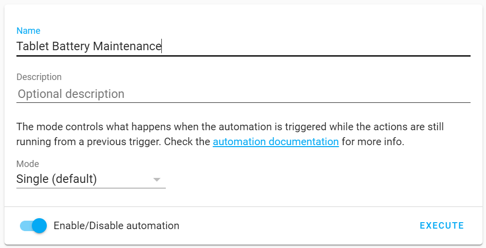
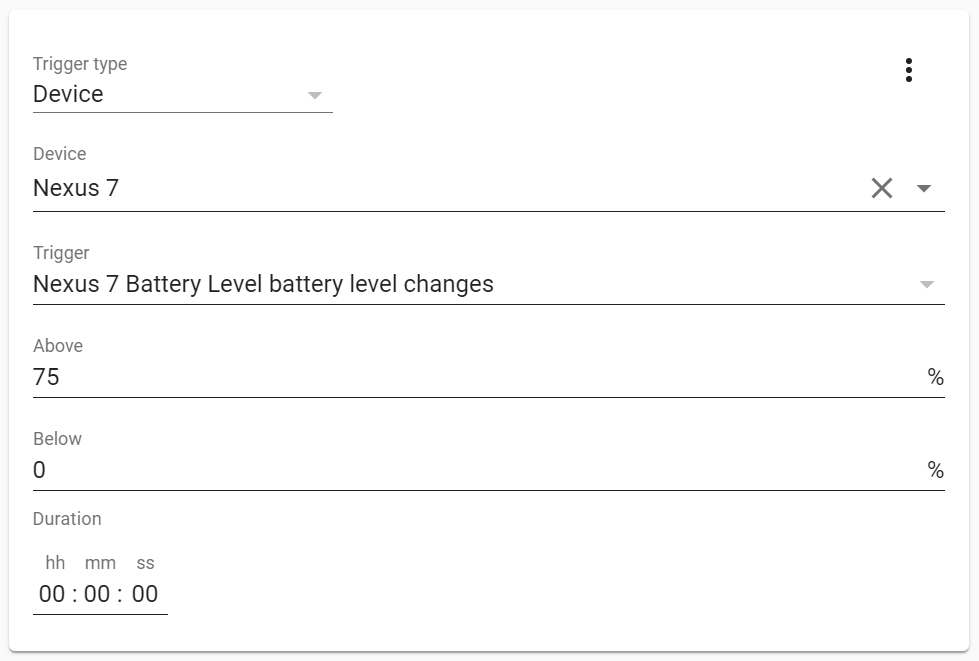
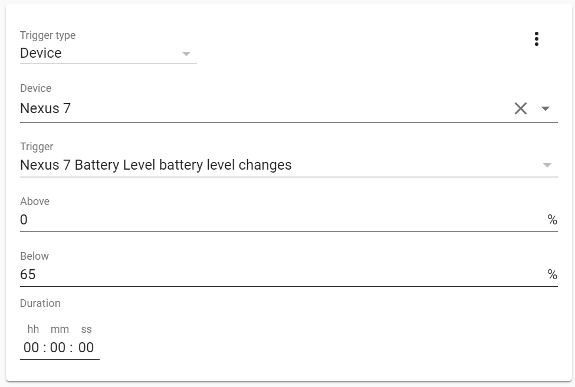
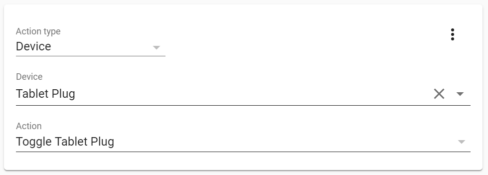
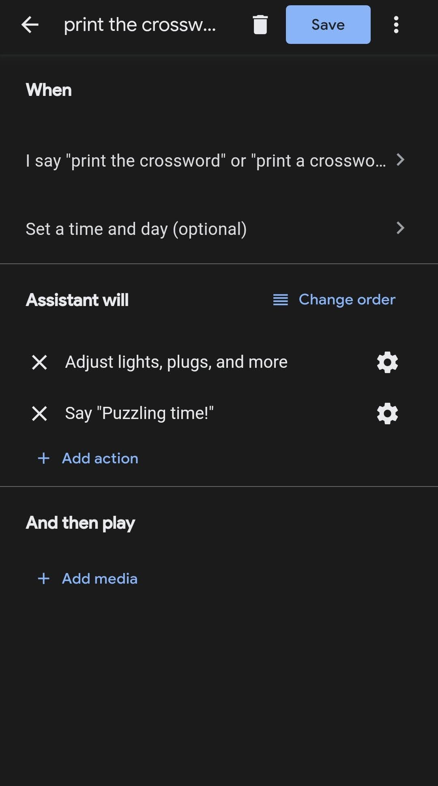
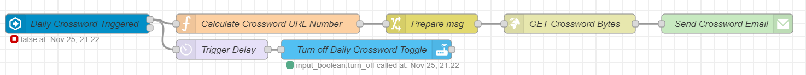

# Automations
This section documents some automations that can be made after following the setup guide. Some are specific to running the Home Assistant server on an Android tablet, and some could be implemented on any Home Assistant installation.

## Tablet Battery Preservation
Keeping the tablet permanently charged at 100% could eventually cause a decrease in battery life. Some Googling indicated that a healthy range to keep the battery is between 65% and 75% (although this is certainly not the best range for every device, so you should do your own research!). 

#### Prerequisites
- a smart plug, added in your Home Assistant configuration
- the Home Assistant Companion App installed on the tablet

#### Automation Setup
In the Home Assistant UI, navigate to Configuration > Automations, and create a new Automation. Add a name and description, and leave the mode as "Single".

In the Triggers section, add two triggers:
- when the tablet battery rises above 75%
- when the tablet battery drops below 65%

In the Actions section, select the "Toggle" action.

If you prefer to manually enter the automation in your automations.yaml, check out [tablet_plug_automation.yaml](tablet_charger/tablet_battery_maintenance_automation.yaml).

## Daily Crossword Print
I like to print out crossword puzzles to give my eyes a break from staring at a screen. Navigating to the website and printing the crossword was tedious, so I set up an automation.

#### Prerequisites
- Node-RED installed and integrated with Home Assistant
	- The [node-red-node-email](https://flows.nodered.org/node/node-red-node-email) nodes must also be installed.
- Google Assistant integrated with Home Assistant
	- Only required if you would like to trigger the crossword print via voice. You could use any voice assistant, but this guide will use Google Assistant.

#### Automation Setup
The majority of the heavy lifting is done in Node-RED, with some small components required in Home Assistant and Google Assistant.

##### Home Assistant
In the Configuration > Helpers section of the Home Assistant UI, add an input boolean with a name of your choosing - "Daily Crossword", for example. When this input boolean is toggled, today's crossword will print.

##### Google Assistant
The Daily Crossword toggle will appear as a switch in Google Assistant. Create a routine to turn on the Daily Crossword switch. The routine will accept a voice command (e.g. "Ok Google, print today's crossword."), or could be set to trigger on a schedule (e.g. every Saturday morning).

##### Node-RED

When the Daily Crossword toggle is turned on, two separate streams are triggered. The bottom stream waits a few seconds, then turns the Daily Crossword toggle back off so that it is ready to be triggered again in the future.

The upper stream first determines the URL from which the crossword can be downloaded. I get my crosswords from the Seattle Times (they re-post the New York Times crossword), and their URL has a number in it increments by one each day. The next node in the flow is another preparation node: it sets `msg.topic` to "Daily Crossword" and `msg.filename` to "crossword.pdf" - these are the title and attachment name of the email that will be sent to the printer.

Now that the URL, filename, and email title are prepared, the GET node queries the URL to retrieve the content of the crossword. The content is saved in a binary buffer, and sent in the `msg.payload` field to the email node.

The email node sends an email, with the title of "Daily Crossword" and the crossword as an attachment named "crossword.pdf" from the configured email account to the email address of the printer. Most network-connected printers have an email address to which you can send content for printing - check your printer settings to find it.

For the full flow, see [daily_crossword_flow.json](daily_crossword/daily_crossword_flow.json).

## Sunrise Alarm
TODO