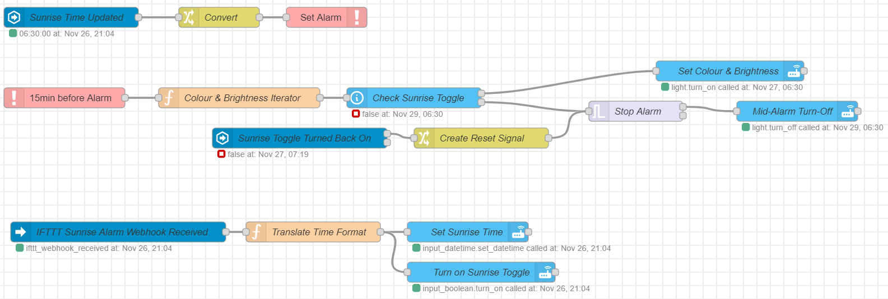

# Automations
This section documents some automations that can be made after following the setup guide. Some are specific to running the Home Assistant server on an Android tablet, and some could be implemented on any Home Assistant installation.

## Tablet Battery Preservation
Keeping the tablet permanently charged at 100% could eventually cause a decrease in battery life. Some Googling indicated that a healthy range to keep the battery is between 65% and 75% (although this is certainly not the best range for every device, so you should do your own research!). 

### Prerequisites
- a smart plug, available in your Home Assistant configuration
- the Home Assistant Companion App installed on the tablet

### Automation Setup
In the Home Assistant UI, navigate to Configuration > Automations, and create a new Automation. Add a name and description, and leave the mode as "Single".

In the Triggers section, add two triggers:
- when the tablet battery rises above 75%
- when the tablet battery drops below 65%

In the Actions section, select the "Toggle" action.

If you prefer to manually enter the automation in your automations.yaml, check out [tablet_plug_automation.yaml](tablet_charger/tablet_battery_maintenance_automation.yaml).

## Daily Crossword Print
I like to print out crossword puzzles to give my eyes a break from staring at a screen. Navigating to the website and printing the crossword was tedious, so I set up an automation.

### Prerequisites
- Node-RED installed and integrated with Home Assistant
	- The [node-red-node-email](https://flows.nodered.org/node/node-red-node-email) nodes must also be installed.
- Google Assistant integrated with Home Assistant
	- Only required if you would like to trigger the crossword print via voice. You could use any voice assistant, but this guide will use Google Assistant.

### Automation Setup
The majority of the heavy lifting is done in Node-RED, with some small components required in Home Assistant and Google Assistant.

#### Home Assistant
In the Configuration > Helpers section of the Home Assistant UI, add an input_boolean with a name of your choosing - "Daily Crossword", for example. When this input_boolean is toggled, today's crossword will print.

#### Google Assistant
The Daily Crossword toggle will appear as a switch in Google Assistant. Create a routine to turn on the Daily Crossword switch. The routine will accept a voice command (e.g. "Ok Google, print today's crossword."), or could be set to trigger on a schedule (e.g. every Saturday morning).

#### Node-RED

When the Daily Crossword toggle is turned on, two separate streams are triggered. The bottom stream waits a few seconds, then turns the Daily Crossword toggle back off so that it is ready to be triggered again in the future.

The upper stream first determines the URL from which the crossword can be downloaded. I get my crosswords from the Seattle Times (they re-post the New York Times crossword), and their URL has a number in it increments by one each day. The next node in the flow is another preparation node: it sets `msg.topic` to "Daily Crossword" and `msg.filename` to "crossword.pdf" - these are the title and attachment name of the email that will be sent to the printer.

Now that the URL, filename, and email title are prepared, the GET node queries the URL to retrieve the content of the crossword. The content is saved in a binary buffer, and sent in the `msg.payload` field to the email node.

The email node sends an email, with the title of "Daily Crossword" and the crossword as an attachment named "crossword.pdf" from the configured email account to the email address of the printer. Most network-connected printers have an email address to which you can send content for printing - check your printer settings to find it.

For the full flow, see [daily_crossword_flow.json](daily_crossword/daily_crossword_flow.json).

## Sunrise Alarm
A sunrise alarm gradually turns the lights in your room on in the morning, which is a gentler wake-up experience than an audio alarm. There are plenty of dedicated devices available for this, but you can achieve the same effect for much cheaper with Home Assistant and a smart light bulb.

### Prerequisites
- Node-RED installed and integrated with Home Assistant
	- The [node-red-contrib-alarm-clock](https://www.npmjs.com/package/node-red-contrib-alarm-clock) nodes must also be installed.
- IFTTT integrated with Home Assistant and Google Assistant
	- Only required if you would like to set the alarm time via voice. You could use any voice assistant, but this guide will use Google Assistant.

### Automation Setup
The majority of the heavy lifting is done in Node-RED. Two components are required in Home Assistant. Google Assistant and IFTTT are only necessary if you want

#### Home Assistant
In the Configuration > Helpers section of the Home Assistant UI, create two new items:
- An input_boolean called "Sunrise".
- An input_datetime called "Sunrise Time".
	- Select the "time" option when creating the input_datetime - no date is needed.

#### IFTTT
From what I have found, there is no way to set the value of Home Assistant's input_datetime directly from Google Assistant. As a workaround, we can place IFTTT in the middle to receive the voice command from Google Assistant and send it on to Home Assistant.

Create an applet with a trigger type of "Google assistant: say a phrase with a number". You can enter three choices of commands to trigger the action: "set sunrise to #" where # is the time, for example. Note that the value of # must be a number, and not a time, so the flow in Node-RED will be configured to receive a decimal number instead of a time. For example: if you wanted to set an alarm at 7:15 AM, you would say "Ok Google, set sunrise to seven point one five".

The action of the applet is of type "Webhook" or "Make a web request". Set the URL to the value you can find in the settings of the IFTTT integration in Home Assistant. Use the POST method type and a content type of "application/json". In the body of the request, enter `{"action": "sunrise_alarm_time", "data": {{NumberField}}}`.

#### Node-RED

The alarm logic is separated in three components.

##### Changing Alarm Time via Voice
The bottom group of logic is responsible for receiving the command from IFTTT and updating the "Sunrise Time" input_boolean in Home Assistant. The leftmost node monitors the Home Assistant event bus for a webhook, then forwards it to the middle node. The middle node takes the time in decimal format ("seven point one five") and converts it into an hour and a minute (hour = 7, minute = 15). Finally, the rightmost nodes set value of the input_datetime in Home Assistant. There is also a node which turns on the Sunrise toggle, because it is assumed that if you are setting the alarm time, you want the alarm to be activated.

##### Setting up Alarm
The uppermost group of logic monitors the "Sunrise Time" input_datetime. Whenever it is updated, regardless of the source of the update, it sets the alarm entity to the corresponding time.

##### Executing Wake-Up Alarm
The middle group of logic executes the logic of the wake-up alarm. It is assumed that the value of the "Sunrise Time" input_datetime is the latest time you want to wake up, so the sunrise alarm begins fifteen minutes before. Once triggered, `Colour & Brightness Iterator` node iterates over the colours and brightnesses in the wake-up sequence, and outputs updated values at regular intervals throughout the fifteen minute wake-up period.

The user must be able to disactivate the alarm either before or during the wake-up sequence (for example: if the user doesn't need an alarm today, or if the user has woken up during the sequence and wants to set the lights to full). Additionally, the user must be able to resume the alarm partway through (for example: if they sleepily turned off the alarm sequence by accident).

To accomplish these needs, the value of the "Sunrise" toggle is checked in two places. First, the toggle acts as a gate between the iterator and the lights: if the toggle is on, the colour and brightness values are let through; if it is off, it turns off the lights. Notice that a trigger node is used to only allow the lights to turn off once per wake-up period - otherwise, the lights will receive continual turn-off commands, and the user won't be able to turn on the lights manually. Second, the "Sunrise" toggle is monitored to see if it is changed during the wake-up sequence. If it is, it resets the trigger node and allows the wake-up sequence to resume.

For the full flow, see [sunrise_alarm_flow.json](sunrise_alarm/sunrise_alarm_flow.json).

### Customization
To change the length of time before wake-up time that the lighting sequence begins, adjust the Offset value in the alarm trigger node.

To change the colours and brightnesses used in the wake-up lighting sequence, adjust the values in the dictionary at the top of the `Colour & Brightness Iterator` node.

## Wall Mount
Not necessarily an automation per se, but one of the main benefits of installing Home Assistant on a tablet is that the installation medium has a built-in touch-screen display. Mounting it on a wall is the best way to make use of that display.

If you have access to a 3D printer, this [design on Thingiverse](https://www.thingiverse.com/thing:664368) takes advantage of the Nexus 7's wireless charging capabilities so that it is easily removable from the mount.